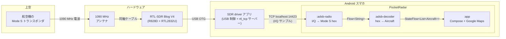
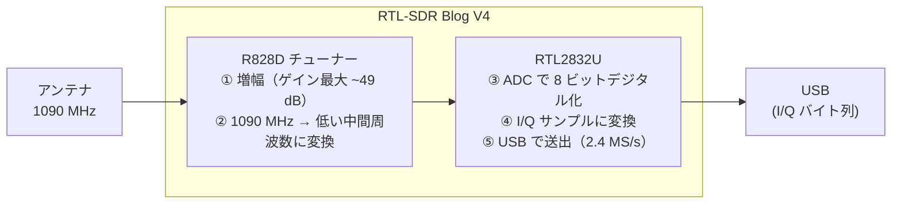
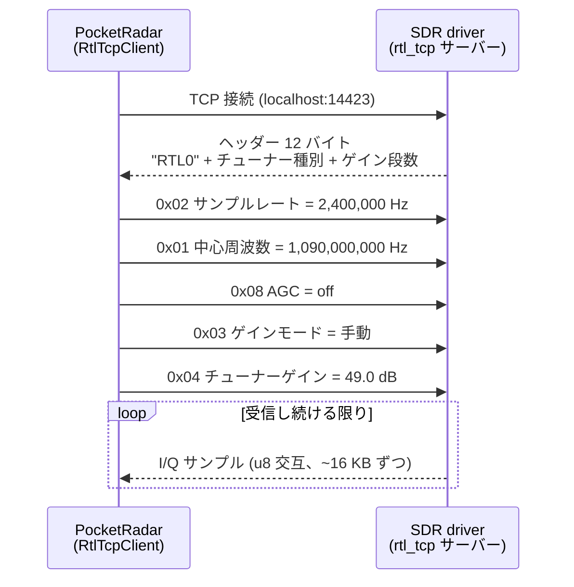
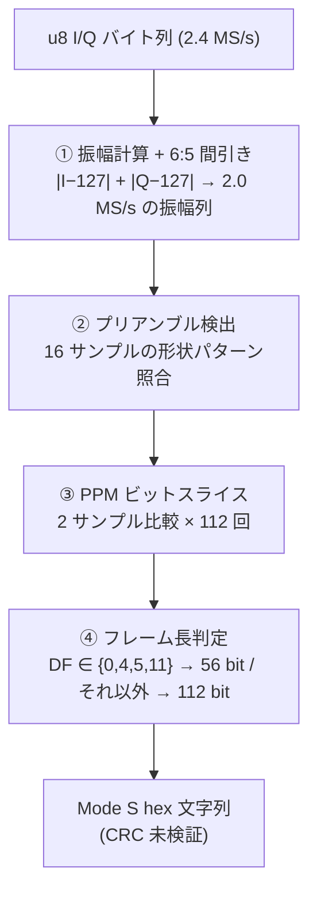
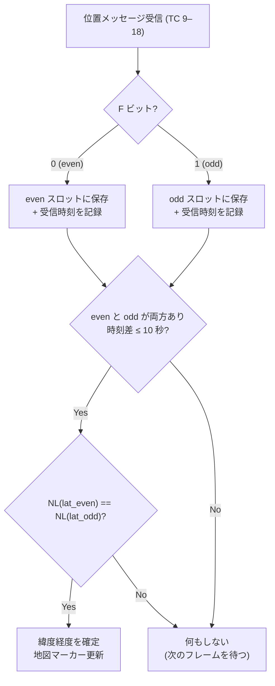

# PocketRadar 要素技術解説

PocketRadar は、上空の航空機が常時放送している **ADS-B**（1090 MHz の電波）を、
数千円の USB ドングル（RTL-SDR）と Android スマホだけで受信・解読し、
Google Maps 上にリアルタイム表示するアプリです。

このドキュメントは、その裏側で使われている要素技術を
「電波が地図上のアイコンになるまで」の順番で解説します。
プレゼン資料の元ネタとして使えるよう、図・表・具体的な数値・実データでの計算例を多めにしています。

> 表記について: ビット位置は特に断りがない限り **0 始まり**（コード内のコメントと同じ）で書きます。

---

## 目次

1. [全体像 — 電波が地図になるまで](#1-全体像--電波が地図になるまで)
2. [ハードウェア](#2-ハードウェア)
3. [ソフトウェア構成と rtl_tcp プロトコル](#3-ソフトウェア構成と-rtl_tcp-プロトコル)
4. [Mode S と ADS-B](#4-mode-s-と-ads-b)
5. [信号のデコード — I/Q サンプルからビット列へ](#5-信号のデコード--iq-サンプルからビット列へ)
6. [CRC-24 — ゴースト機を消す門番](#6-crc-24--ゴースト機を消す門番)
7. [CPR — 17 ビットで緯度経度を送る仕組み（ノギスの原理）](#7-cpr--17-ビットで緯度経度を送る仕組みノギスの原理)
8. [その他のフィールドのデコード](#8-その他のフィールドのデコード)
9. [用語集](#9-用語集)
10. [参考文献](#10-参考文献)

---

## 1. 全体像 — 電波が地図になるまで



データの姿は、各段階でこう変わっていきます。

| 段階 | データの姿 | 具体例 |
|---|---|---|
| 空中 | 1090 MHz のパルス列（PPM 変調） | 8 μs プリアンブル + 112 ビット（1 メッセージ 120 μs） |
| USB / TCP | 8 ビット I/Q サンプル（2.4 MS/s） | `I, Q, I, Q, …` の生バイト列（毎秒約 4.8 MB） |
| `:adsb-radio` 出力 | Mode S フレームの 16 進文字列 | `8d71c7095875e3e5a95127f79925` |
| `:adsb-decoder` 出力 | `Aircraft` オブジェクト | ICAO=`71C709`, 高度 22,550 ft, (35.8456, 139.9388) |
| 画面 | 地図上の回転する機体マーカー + 航跡 | — |

ポイントは **「復調（電波→ビット）」と「デコード（ビット→意味）」を別モジュールに分けている**ことです。
`:adsb-radio` はノイズ由来の偽フレームも構わず出力し、`:adsb-decoder` が CRC で門番をします（→ [6 章](#6-crc-24--ゴースト機を消す門番)）。

---

## 2. ハードウェア

### 2.1 機材一覧と役割

| 機材 | 型番・仕様 | 役割 |
|---|---|---|
| 送信側: トランスポンダ | （航空機に搭載） | GPS で自機位置を測位し、1090 MHz で常時放送。受信側は一切送信しない（**受信専用**） |
| アンテナ | 1090 MHz 用 6 dBi グラスファイバー製コリニア | 1090 MHz の電波を効率よく捕まえる。波長 λ = c/f ≈ **27.5 cm** に共振するよう設計されている |
| 同軸ケーブル | RG58（N メス – SMA オス） | アンテナ → 受信機間の高周波伝送。長いほど減衰するので数 m まで |
| 受信機 | **RTL-SDR Blog V4**（R828D チューナー搭載） | 1090 MHz の電波をデジタルデータ（I/Q サンプル）に変換する心臓部 |
| USB OTG アダプタ | Type-C オス → USB-A メス | スマホを USB ホストにしてドングルを接続 |
| 給電付き OTG ケーブル / ハブ | **強く推奨** | V4 は約 **280–300 mA** 消費する。スマホのバスパワーだけでは不安定なため外部給電する |
| Android スマホ | Android 14 以降 | 復調・デコード・地図表示のすべてを実行 |

接続チェーン:

```
Android (USB-C) ──[給電付き OTG]── RTL-SDR Blog V4 ──[RG58 同軸]── 1090 MHz アンテナ
```

### 2.2 RTL-SDR とは — テレビチューナーの「転用」

RTL-SDR は **SDR（Software Defined Radio、ソフトウェア無線）** の受信機です。
従来の無線機がフィルタや復調回路をハードウェアで持つのに対し、SDR は
「電波をなるべく生のままデジタル化し、あとはソフトウェアで処理する」という思想です。

RTL-SDR の面白いところは、もともと**ヨーロッパの地デジ（DVB-T）用 USB テレビチューナー**だったことです。
2012 年頃、搭載チップ RTL2832U に「復調前の生サンプルを USB に流すモード」があることが発見され、
数千円で買える万能受信機として世界中に広まりました。

ドングル内部は 2 つのチップの分業です:



| チップ | 役割 |
|---|---|
| **R828D**（チューナー） | 目的の周波数（1090 MHz）を狙って受信し、増幅し、後段が扱える低い周波数（中間周波数）へ変換する「周波数の引っ越し係」 |
| **RTL2832U**（ADC + USB） | アナログ信号を 1 秒あたり 240 万回、8 ビットで標本化し、I/Q ペアとして USB へ流す「デジタル化係」 |

### 2.3 I/Q サンプルとは

SDR が出力する **I/Q サンプル**は、電波の瞬間的な状態を複素数
（I = 実部、Q = 虚部）で表したものです。振幅と位相の両方を保存できるため、
どんな変調方式でも後からソフトウェアで復調できます。

RTL-SDR の場合は I も Q も **符号なし 8 ビット（0–255、無信号時の中心が 127）**で、
`I, Q, I, Q, …` と交互に並んで流れてきます。

ADS-B は幸い「パルスが有るか無いか」だけの変調（→ [5 章](#5-信号のデコード--iq-サンプルからビット列へ)）なので、
位相は使わず **振幅（magnitude）** だけ計算すれば十分です。

### 2.4 アンテナの選び方の背景

- 1090 MHz の波長は約 27.5 cm。アンテナの素子長はこの波長に合わせて設計される（1/2 波長 ≈ 13.8 cm など）。
- **6 dBi** という利得は「電波を水平方向に集中させる」ことを意味する。航空機は基本的に
  水平線方向の遠くにいるので、上下方向の感度を犠牲にして水平方向を稼ぐのが合理的。
- 1090 MHz は**見通し内伝搬**（光とほぼ同じ性質）。障害物がなければ 200–400 km 先の
  航空機まで受信できる。窓際 vs 屋外で受信数が大きく変わるのはこのため。

---

## 3. ソフトウェア構成と rtl_tcp プロトコル

### 3.1 責務分担 — USB 制御は既存アプリに委譲

PocketRadar は **USB デバイスを直接触りません**。
Android での USB パーミッション処理や RTL2832U / R828D の初期化は、実績のある
**SDR driver アプリ**（`marto.rtl_tcp_andro`、旧称 RTL2832U Driver）に任せ、
そのアプリが立てる `rtl_tcp` サーバー（`localhost:14423`）に TCP クライアントとして接続します。

この分離により、PocketRadar 本体は**信号処理と UI という教材の本題に集中**できます。

| モジュール | 役割 | 依存 |
|---|---|---|
| `:adsb-radio` | `rtl_tcp` クライアント + I/Q 復調器。`Flow<String>`（Mode S hex）を出力 | 純 Kotlin/JVM。Android 非依存 |
| `:adsb-decoder` | Mode S hex → `Aircraft`。CRC-24、DF=17 パーサ、CPR ペア復号 | 純 Kotlin/JVM。Android 非依存 |
| `:app` | Compose + Google Maps の UI、フォアグラウンドサービス、リプレイ/ライブ切り替え | Android |

2 つのライブラリモジュールが Android 非依存の純 Kotlin なのは意図的で、
**JUnit だけで（実機なしで）実データを使った回帰テストができる**ようにするためです。

### 3.2 rtl_tcp プロトコル

`rtl_tcp` は librtlsdr 由来のシンプルな TCP プロトコルです。



- コマンドは常に **5 バイト固定**（コード 1 バイト + パラメータ 4 バイト、ビッグエンディアン）。
- ADS-B 用の設定値: **1090 MHz / 2.4 MS/s / AGC オフ + 手動ゲイン最大（49.0 dB）**。
  AGC（自動ゲイン制御）を切るのは、ADS-B のようなパルス信号では AGC が
  「無音区間に合わせてゲインを上げすぎる」暴れ方をするためです。
- ポート 14423 は Android 版ドライバの既定値（本家 `rtl_tcp` の既定は 1234）。

---

## 4. Mode S と ADS-B

### 4.1 歴史的な文脈 — 質問方式から放送方式へ

| 世代 | 仕組み | 得られる情報 |
|---|---|---|
| **一次レーダー (PSR)** | 地上から電波を発射し、機体表面の反射を見る | 方位と距離のみ。相手の協力不要 |
| **二次レーダー (SSR) Mode A/C** | 地上局が 1030 MHz で質問 → 機上のトランスポンダが 1090 MHz で応答 | Mode A: 便ごとの 4 桁識別番号（スコーク）<br>Mode C: 気圧高度 |
| **SSR Mode S** | 質問に **24 ビットの機体固有アドレス**を含め、特定の 1 機だけを狙って質問できる (Selective) | 高度・識別 + データリンク |
| **ADS-B** | 質問なしで**機体が勝手に放送**。位置は機体自身が GPS で測る | 位置・高度・速度・便名など |

ADS-B の正式名称がそのまま仕組みの説明になっています:

- **A**utomatic — 質問されなくても自動的に送信する
- **D**ependent — 位置情報は機体自身の測位（GNSS）に依存する
- **S**urveillance — 監視のための情報である
- **B**roadcast — 特定の相手ではなく全方位に放送する

### 4.2 ADS-B は「Mode S の 1 メッセージ種別」

重要な関係: **ADS-B は Mode S と別の電波ではありません**。
Mode S の下り信号（1090 MHz）には Downlink Format（DF）という 5 ビットの種別があり、
そのうち **DF=17（Extended Squitter、拡張スキッタ）が ADS-B** です。
Squitter とは「聞かれていないのに勝手にしゃべる送信」を指す業界用語です。

| フレーム長 | DF | 用途 |
|---|---|---|
| 短い 56 ビット | 0, 4, 5, 11 | SSR 応答（高度・スコーク・オールコール応答） |
| 長い 112 ビット | 16–21, 24 | データリンク（Comm-B）や **ADS-B（DF=17）** |

### 4.3 112 ビットフレームの構造

```
 bit:    0     5    8                     32                                          88           112
         ┌─────┬────┬──────────────────────┬────────────────────────────────────────────┬─────────────┐
         │ DF  │ CA │        ICAO          │                  ME (ペイロード)            │   CRC-24    │
         │5bit │3bit│       24 bit         │                    56 bit                  │   24 bit    │
         └─────┴────┴──────────────────────┴────────────────────────────────────────────┴─────────────┘
 byte:    [ 0 ]      [   1   2   3  ]       [   4   5   6   7   8   9  10  ]            [ 11  12  13 ]
```

| フィールド | ビット | 意味 |
|---|---|---|
| **DF** | 0–4 | Downlink Format。ADS-B = 17 |
| **CA** | 5–7 | 機体の能力（Capability） |
| **ICAO** | 8–31 | 24 ビットの機体固有アドレス。**世界で 1 機に 1 つ**、国ごとに割当（例: `71C709` は韓国機、`86xxxx` 帯は日本機） |
| **ME** | 32–87 | 本文 56 ビット。先頭 5 ビットが **Type Code（TC）** で中身の種類を決める |
| **CRC-24** | 88–111 | 誤り検出パリティ（→ [6 章](#6-crc-24--ゴースト機を消す門番)） |

先頭バイトは `(DF << 3) | CA` なので、DF=17 のフレームは必ず `0x88`–`0x8F` で始まります
（実キャプチャでは `8d…` がほとんど。`8d` = DF 17, CA 5）。

### 4.4 Type Code — ME の中身の種類

| TC | 内容 | 送信頻度の目安 | PocketRadar |
|---|---|---|---|
| 1–4 | 機体識別（コールサイン、例 `ANA37`） | 5 秒に 1 回 | ✅ デコード |
| 5–8 | 地上位置（タキシング中） | — | スキップ |
| **9–18** | **空中位置**（気圧高度 + CPR 緯度経度） | **毎秒 2 回** | ✅ デコード |
| **19** | **速度**（対地速度・針路・昇降率） | 毎秒 2 回 | ✅ デコード |
| 20–22 | 空中位置（GNSS 高度版） | — | スキップ |
| 23–31 | その他（ステータス等） | — | スキップ |

1 機の航空機は**毎秒 4–5 メッセージ**程度を放送しており、上空に 20 機いれば
毎秒 100 メッセージ規模のストリームになります。

---

## 5. 信号のデコード — I/Q サンプルからビット列へ

`:adsb-radio` の `IqDemodulator` が担当する部分です。
方式は本家 dump1090 と同じで、以下の 4 ステップです。



### 5.1 なぜ 2.4 MS/s で受けて 2.0 MS/s に間引くのか

Mode S のビットレートは **1 Mbps（1 ビット = 1 μs）**、パルスの最小単位は 0.5 μs です。
サンプルレートを 2.0 MS/s にすると:

- 1 ビット = ちょうど **2 サンプル**
- 0.5 μs = ちょうど **1 サンプル**

と割り切れて、以降の処理が「サンプルの引き算と比較」だけで書けます。
一方 RTL-SDR が安定して出せるレートは 2.4 MS/s なので、
**6 サンプルごとに 1 つ捨てる（6:5 間引き）**ことで 2.0 MS/s に揃えています。
乱暴に見えますが、Mode S の占有帯域（約 2 MHz）は間引き後のナイキスト帯域に収まるため実用上問題ありません。

振幅は L1 近似 `|I−127| + |Q−127|` で計算します。本来の振幅は `√(I²+Q²)` ですが、
「パルスの有無」を比べるだけなら大小関係が保たれれば十分で、8 ビットサンプルには
この近似が高速で十分正確です。

### 5.2 プリアンブル検出 — 「メッセージが始まる合図」を探す

各メッセージの先頭には **8 μs のプリアンブル**が付きます。
0.0 / 1.0 / 3.5 / 4.5 μs の位置に 0.5 μs 幅のパルスが 4 本立ち、それ以外は無音です。

```
振幅
 ▲
 │  ██      ██              ██      ██
 │  ██      ██              ██      ██        （この後に 112 ビットの本文）
 └──┴───┴───┴───┴───┴───┴───┴───┴───┴───┴──▶ 時間
    0  0.5  1.0 1.5  2.0 2.5 3.0 3.5 4.0 4.5 … 8.0 μs

 2 MS/s でのサンプル番号:  0   2         7   9   ← この 4 点が「高い」
```

検出は 2 段構えです:

1. **形状チェック**（dump1090 の隣接比較方式）:
   `m0 > m1`, `m1 < m2`, `m2 > m3`, … と、パルス位置と無音位置の**大小関係のパターン**を照合する。
   絶対的なしきい値を使わないので、受信機のゲイン変動や機体との距離に影響されにくい。
2. **強度チェック**: 4 本のパルスの最小値が、無音区間の最大値の **2 倍以上**であることを要求。
   これがないと、たまたま形が合っただけのノイズが大量に通過して CRC 通過率が激減する。

### 5.3 PPM（パルス位置変調）— パルスの「位置」がビット

Mode S の変調は **PPM（Pulse Position Modulation）**です。
1 ビット分の 1 μs を前半・後半に分け、**パルスがどちら側にあるか**で 0/1 を表します。

```
   ビット "1"          ビット "0"
  ┌────┐               　   ┌────┐
  │ ██ │    　          　  │ ██ │
──┴────┴─────      ─────────┴────┴──
  前半  後半           前半   後半
 (高い)(低い)         (低い) (高い)
```

2 MS/s では 1 ビット = 2 サンプルなので、デコードは
**「1 サンプル目 > 2 サンプル目なら 1、そうでなければ 0」** という比較 112 回だけです。

PPM の利点は**振幅の絶対値に意味がない**こと。遠い機体（弱い信号）でも近い機体（強い信号）でも、
「前半と後半のどちらが高いか」という相対比較だけで復調できます。

### 5.4 フレーム長の判定と後段への引き渡し

まず 112 ビット分を読み、先頭 5 ビットの DF を見て
DF ∈ {0, 4, 5, 11} なら 56 ビット（14 桁 hex）に切り詰め、それ以外は 112 ビット（28 桁 hex）のまま出力します。

**この段階では CRC を検証しません**。ノイズを拾った偽フレームも大量に混ざったまま
hex 文字列として下流に流し、`AdsbDecoder` がまとめて CRC で選別します。
「復調は感度優先で拾えるだけ拾い、正しさの保証は 1 か所に集約する」という設計です。

また、TCP のチャンク境界をまたぐフレームを取りこぼさないよう、
直前チャンクの末尾 1 KB（1 フレーム最大 120 μs ≈ 576 バイトに余裕を持たせた値）を
次のチャンクの先頭に連結して再スキャンしています（`RtlTcpMessageSource`）。

---

## 6. CRC-24 — ゴースト機を消す門番

### 6.1 仕組み

Mode S フレームの末尾 24 ビットは **CRC-24 パリティ**です。
送信側は先頭 88 ビットを生成多項式

```
G(x) = x²⁴ + x²³ + … + 1   （24 ビット表現で 0xFFF409）
```

で割った余りを末尾に付けて送ります。受信側で **112 ビット全体**に同じ割り算を実行すると、
伝送誤りがなければ余り（**シンドローム**）がちょうど 0 になります。

```
受信フレーム 112 bit ──[ G(x) で多項式除算 ]──▶ シンドローム == 0 ? ── Yes → 採用
                                                       │
                                                       No → 破棄（1 ビットでも化けていれば非ゼロ）
```

PocketRadar の実装（`Crc24.kt`)は、あえてテーブル化せず**ビット単位のシフトと XOR** で書いてあります。
約 24 倍遅いのですが、多項式除算の仕組みがコードにそのまま見えるためです（教材優先の設計判断）。

### 6.2 なぜ CRC が死活的に重要か

[5 章](#5-信号のデコード--iq-サンプルからビット列へ)の復調器は感度優先なので、
**ノイズがたまたまプリアンブルの形に見えた偽フレーム**を日常的に出力します。
CRC チェックなしでこれを信じると、地図上に実在しない機体（**ゴースト**）が次々出現します。

ランダムなビット列が偶然 CRC を通過する確率は 2⁻²⁴ ≈ **1,680 万分の 1**。
この 24 ビットが「偽フレームの洪水」と「地図に出す情報」の間の実質唯一の門番です。

> 補足: Mode S の CRC は本来、誤り検出だけでなく DF によっては ICAO アドレスを CRC に
> 重畳する使い方（Address/Parity）もありますが、DF=17 は純粋なパリティ（シンドローム 0 判定）です。

---

## 7. CPR — 17 ビットで緯度経度を送る仕組み（ノギスの原理）

ADS-B の位置メッセージ（TC 9–18）の中身はこうなっています。

```
 ME (56 bit) — 0 始まりのビット位置
 ┌───────┬────┬─┬────────────┬─┬─┬──────────────────┬──────────────────┐
 │  TC   │ SS │S│  高度 12bit │T│F│  CPR 緯度 17bit  │  CPR 経度 17bit  │
 │ 0–4   │5–6 │7│    8–19    │ │ │      22–38       │      39–55       │
 └───────┴────┴─┴────────────┴─┴─┴──────────────────┴──────────────────┘
                              20 21
                                 └─ F ビット: 0 = 偶数(even)フレーム / 1 = 奇数(odd)フレーム
```

緯度も経度も **17 ビットしかありません**。これが CPR（Compact Position Reporting、コンパクト位置通報）です。

### 7.1 なぜ圧縮が必要か

緯度経度を素朴に送るとどうなるか。地上 5 m の分解能を出すには:

- 緯度: 180° ÷ 0.000045° ≈ 400 万段階 → **22 ビット**
- 経度: 360° ÷ 0.000045° ≈ 800 万段階 → **23 ビット**

合計 45 ビット。高度 12 ビットや TC などと合わせると 56 ビットの ME に収まりません。
CPR は緯度経度を **17 + 17 = 34 ビット**に抑えつつ、**約 5 m の分解能**を実現します。

### 7.2 基本アイデア — 「ゾーン内の位置」だけを送る

CPR は地球の緯度方向を数度幅の**ゾーン（zone）**に輪切りにし、
メッセージには**「ゾーン内のどこにいるか」の小数部分だけ**を 17 ビットで載せます。
**「どのゾーンにいるか（整数部分）」は送りません。**

```
緯度 35.84564° を送りたい。ゾーン幅が 6° なら:
  35.84564 ÷ 6 = 5.974…
                 └┬┘└──┬──┘
             ゾーン番号  ゾーン内位置 0.974…
              (送らない)  (× 2¹⁷ = 127,700 を 17bit で送る)
```

当然、1 通だけ受信しても「6° ごとに繰り返す候補のどれか」までしか分かりません。
世界中に 60 個の緯度候補が等間隔に並ぶイメージです。この曖昧さを解くのが次の仕掛けです。

### 7.3 偶数と奇数 — わずかに違う 2 つの「ものさし」

CPR は**ゾーン幅が微妙に異なる 2 種類のフレーム**を交互に送ります（F ビットで区別）。

| フレーム | 緯度ゾーン数 | ゾーン幅 dLat |
|---|---|---|
| 偶数（even, F=0） | **60** | 360° ÷ 60 = **6.0000°** |
| 奇数（odd, F=1） | **59** | 360° ÷ 59 = **6.1017°** |

### 7.4 ノギスの原理

この「わずかに違う 2 つの目盛り」は、**ノギス（バーニヤ・キャリパー）と同じ原理**です。

ノギスは、1 mm 刻みの主尺と、0.9 mm 刻みの副尺という
**ピッチがわずかに違う 2 つの目盛り**を重ね、目盛り同士の「ずれ具合」を読むことで、
主尺単独では読めない 0.1 mm の端数を復元します。

CPR も同じ構図です:

|  | ノギス | CPR |
|---|---|---|
| 目盛り A | 主尺 1.0 mm ピッチ | 偶数フレーム 6.0000°/ゾーン |
| 目盛り B | 副尺 0.9 mm ピッチ | 奇数フレーム 6.1017°/ゾーン |
| 単独では分からない情報 | 0.1 mm 単位の端数 | **ゾーン番号（整数部）** |
| 復元の手がかり | 2 つの目盛りの**一致点** | 2 つの読み値の**ずれ** |

核心はこうです。同じ緯度を 2 つのものさしで測ると、
**「偶数目盛りでの読み」と「奇数目盛りでの読み」のずれ方が、ゾーン番号に正比例して変わる**。
だから、ずれを測ればゾーン番号が逆算できるのです。

```
偶数目盛り (6.0000°/ゾーン)
 0°      6°      12°     18°     24°     30°     36°
 ├───────┼───────┼───────┼───────┼───────┼───────┼──▶
 │ zone0 │ zone1 │ zone2 │ zone3 │ zone4 │ zone5 │        読み: zone5 + 0.974

奇数目盛り (6.1017°/ゾーン) — 少しずつ遅れて目盛りがズレていく
 0°       6.1°     12.2°    18.3°    24.4°    30.5°   36.6°
 ├────────┼────────┼────────┼────────┼────────┼───────┼─▶
 │ zone0  │ zone1  │ zone2  │ zone3  │ zone4  │ zone5 │  読み: zone5 + 0.875
                                            ▲
                                     機体の緯度 35.84564°
 → 小数部の読みの差 (0.974 − 0.875) ≈ ゾーンが進むごとに 1/59 ずつ開く
 → 差を見ればゾーン番号が分かる！
```

数式にすると、真の緯度 lat に対して

```
60 × lat / 360 = zE + fE   （zE: 偶数のゾーン番号, fE: 偶数フレームの 17bit 値 ÷ 2¹⁷）
59 × lat / 360 = zO + fO   （zO: 奇数のゾーン番号, fO: 奇数フレームの値）
```

辺々 6 倍・6.1017 倍して等置し整理すると、**送られてこないはずのゾーン番号が小数部だけから求まる**:

```
j = 59·fE − 60·fO  … これが必ず整数（緯度ゾーン番号）になる！

実装では丸め誤差対策で  j = floor(59·fE − 60·fO + 0.5)
```

j が分かれば緯度は直ちに復元できます:

```
lat_even = 6.0000° × (j mod 60 + fE)
lat_odd  = 6.1017° × (j mod 59 + fO)   ← 2 つの推定値のうち新しい方のフレームの値を採用
```

### 7.5 経度 — 緯度に応じてゾーン数が変わる（NL テーブル）

経度も同じ原理ですが、ひとひねりあります。
経線は極に近づくほど間隔が狭まるため、**ゾーン数を緯度に応じて変える**のです
（メートル単位の分解能を全緯度でほぼ一定に保つため）。

- 緯度からゾーン数を返す関数 **NL(lat)**（Number of Longitude zones、1〜59）が
  規格の**ルックアップテーブル**（DO-260B Table A-21、58 個のしきい値）で定義されている。
- 偶数フレームは NL 個、奇数フレームは NL−1 個のゾーンで経度を刻む。
- ゾーン番号 m は緯度と同様に `m = floor(fE·(NL−1) − fO·NL + 0.5)` で復元。

| 緯度帯の例 | NL | 経度ゾーン幅（偶数） |
|---|---|---|
| 赤道付近 (< 10.47°) | 59 | 6.10° |
| 東京付近 (≈ 35.8°) | 48 | 7.50° |
| 北欧 (≈ 59°) | 30 | 12.0° |
| 極域 (> 87°) | 1 | 360° |

**落とし穴**: 偶数フレームと奇数フレームの間に機体が NL の境界緯度をまたぐと、
2 つのフレームが異なるゾーン割りで符号化されてしまい、組み合わせ不能になります。
実装では `NL(lat_even) ≠ NL(lat_odd)` のとき **null を返してペアを捨て**、次のペアを待ちます。

### 7.6 実データでの計算例

東京近郊で実際に受信したペア（ICAO `71C709`、テストフィクスチャにも収録）で全手順を追います。

**入力フレーム:**

| | 偶数フレーム | 奇数フレーム |
|---|---|---|
| hex | `8d71c7095875e3e5a95127f79925` | `8d71c7095875d77f9e8a4aa03e8d` |
| TC | 11（空中位置） | 11（空中位置） |
| F ビット | 0 (even) | 1 (odd) |
| 高度 | 22,550 ft | 22,525 ft |
| CPR 緯度（17bit 生値） | 127,700 | 114,639 |
| CPR 経度（17bit 生値） | 86,311 | 35,402 |

**ステップ 1 — 17 ビット値を 0〜1 の小数に正規化**（÷ 2¹⁷ = 131,072）:

```
fE(lat) = 127700 / 131072 = 0.974274      fO(lat) = 114639 / 131072 = 0.874626
fE(lon) =  86311 / 131072 = 0.658501      fO(lon) =  35402 / 131072 = 0.270096
```

**ステップ 2 — 緯度ゾーン番号 j を「ずれ」から復元:**

```
j = floor(59 × 0.974274 − 60 × 0.874626 + 0.5)
  = floor(57.4822 − 52.4776 + 0.5) = floor(5.5046) = 5      ← ゾーン 5！
```

**ステップ 3 — 緯度を復元:**

```
lat_even = 6.0000° × (5 + 0.974274) = 35.84564°
lat_odd  = 6.1017° × (5 + 0.874626) = 35.84518°   （差 ≈ 50 m は受信時刻差の移動分）
→ 新しい方（この例では even）を採用: lat = 35.84564°
```

**ステップ 4 — NL チェックと経度ゾーン番号 m:**

```
NL(35.84564) = 48, NL(35.84518) = 48  → 一致、続行 OK
m = floor(0.658501 × 47 − 0.270096 × 48 + 0.5) = floor(18.485) = 18
```

**ステップ 5 — 経度を復元:**

```
lon = (360 / 48) × (18 + 0.658501) = 7.5° × 18.658501 = 139.93876°
```

**結果: (35.84564°N, 139.93876°E)、高度 22,550 ft** — 東京近郊、江戸川上空あたりを飛行中の機体です。

分解能の確認: 緯度方向 6° ÷ 2¹⁷ ≈ 0.0000458° ≈ **5.1 m**。
17 ビットでこの精度が出るのが CPR の設計の妙です。

### 7.7 実装上のルールまとめ



- **ペアの有効期限は 10 秒**（`cprPairTtlMillis`）。位置は毎秒 2 回送られるので、
  受信状態が良ければ数秒でペアが揃う。古いペアを許すと機体の移動で位置が歪む。
- CPR には「受信機の位置を基準に 1 フレームで解く」**ローカルデコード**もあるが、
  PocketRadar は教材のスコープを絞るため**グローバル（even/odd ペア）方式のみ**実装。

---

## 8. その他のフィールドのデコード

### 8.1 高度 — Q ビットと 25 ft 刻み

位置メッセージ内の高度 12 ビットは、中央付近の 1 ビット（**Q ビット**）が単位系を切り替えます。

- **Q=1**（現代の機体はほぼこちら）: Q ビットを抜いた 11 ビットを N として
  `高度 = N × 25 − 1000 [ft]`。25 ft 刻み、−1000〜+50,175 ft。
- **Q=0**: 100 ft 刻みの Gillham コード（Mode C 由来のグレイコード系）。
  現代機ではまれなので PocketRadar は null 扱い。

なお ADS-B の高度は**気圧高度**（標準大気での換算値）であり、GPS の幾何学的高度とは別物です。

### 8.2 コールサイン — 6 ビット文字 × 8 文字

識別メッセージ（TC 1–4）は、48 ビットに **6 ビット × 8 文字**を詰めます。
文字集合は ICAO 規定のサブセット（A–Z, 0–9, スペース）だけなので、
ASCII の 8 ビットではなく 6 ビットで足ります。

```
6bit 値:  1–26 → 'A'–'Z'    48–57 → '0'–'9'    32 → ' '    それ以外 → 無効(捨てる)
例: "ANA37   " → 末尾スペースを削って "ANA37"
```

### 8.3 速度 — 東西・南北ベクトルから合成

速度メッセージ（TC=19、サブタイプ 1/2）は、速度を**東西成分と南北成分のベクトル**で送ります。
受信側で三平方の定理と逆正接を使って合成します。

```
対地速度 = √(V東西² + V南北²)  [ノット]
針路     = atan2(V東西, V南北) を 0–360° に正規化（真北基準・時計回り）
昇降率   = (生値 − 1) × 64 [ft/min]（符号ビットで上昇/降下）
```

エンコードの罠が 2 つあります:

- 各成分は「実際の値 + 1」で符号化される（**生値 0 は「情報なし」のセンチネル**）。
  このガードを忘れると −1 kt という無意味な値と出鱈目な針路が生まれる。
- サブタイプ 2 は超音速機用で、値を 4 倍して解釈する。

地図上の機体アイコンはこの針路（track）で回転させています。

---

## 9. 用語集

| 用語 | 読み / 正式名称 | 意味 |
|---|---|---|
| **ADS-B** | Automatic Dependent Surveillance–Broadcast | 機体が自機の GNSS 測位結果を 1090 MHz で自発的に放送する監視方式。Mode S の DF=17 メッセージ |
| **Mode S** | モード・エス (Selective) | 24 ビット固有アドレスで特定機を選んで質問できる二次レーダー方式。ADS-B の土台 |
| **Mode A/C** | — | 旧世代のトランスポンダ応答。A は 4 桁識別番号、C は気圧高度 |
| **SSR** | Secondary Surveillance Radar / 二次監視レーダー | 地上から質問電波 (1030 MHz) を出し、機上トランスポンダの応答 (1090 MHz) を受ける方式 |
| **トランスポンダ** | Transponder (Transmitter + Responder) | 質問電波に自動応答する機上装置。ADS-B ではこれが自発放送も行う |
| **Squitter / Extended Squitter** | スキッタ / 拡張スキッタ | 質問なしの自発送信。Extended Squitter (1090ES) = DF=17 の 112 ビット版 = ADS-B |
| **DF** | Downlink Format | Mode S 下りフレームの種別 (先頭 5 ビット)。ADS-B は DF=17 |
| **CA** | Capability | DF に続く 3 ビット。機体の応答能力を示す |
| **ICAO アドレス** | International Civil Aviation Organization | 機体ごとに世界で一意な 24 ビットアドレス。国別に割当（日本は `86xxxx` 帯など） |
| **ME** | Message, Extended Squitter | DF=17 フレームの 56 ビット本文 |
| **TC** | Type Code | ME 先頭 5 ビット。本文の種類（識別 / 位置 / 速度…）を決める |
| **CPR** | Compact Position Reporting | 緯度経度を 17 ビットずつに圧縮する符号化。even/odd ペアで曖昧さを解く（ノギスの原理） |
| **NL 関数** | Number of Longitude zones | 緯度→経度ゾーン数 (1–59) の規格ルックアップテーブル |
| **Q ビット** | — | 高度フィールドの単位切替ビット。1 なら 25 ft 刻み |
| **CRC-24** | Cyclic Redundancy Check | 24 ビット巡回冗長検査。生成多項式 0xFFF409。シンドローム 0 で無傷と判定 |
| **シンドローム** | Syndrome | 受信フレーム全体を生成多項式で割った余り。0 以外 = ビット化け |
| **PPM** | Pulse Position Modulation / パルス位置変調 | 1 μs 中のパルスの位置（前半/後半）で 1/0 を表す変調。振幅の絶対値に依存しない |
| **プリアンブル** | Preamble | メッセージ先頭の 8 μs の合図パターン。0/1.0/3.5/4.5 μs にパルス 4 本 |
| **SDR** | Software Defined Radio / ソフトウェア無線 | 電波を生のままデジタル化し、復調をソフトウェアで行う無線機の方式 |
| **RTL-SDR** | — | DVB-T チューナー (RTL2832U) を汎用受信機に転用した安価な SDR。本機は RTL-SDR Blog V4 |
| **RTL2832U** | — | ADC + USB を担うチップ。生 I/Q サンプルを USB に流せる裏モードが SDR 転用の起源 |
| **R828D** | — | チューナーチップ。目的周波数を増幅し中間周波数へ変換する |
| **I/Q サンプル** | In-phase / Quadrature | 電波の瞬時状態を複素数 (実部 I, 虚部 Q) で表した標本。振幅と位相を両方保持 |
| **MS/s** | Mega Samples per second | 1 秒あたりのサンプル数 (百万単位)。本機は 2.4 MS/s 受信 → 2.0 MS/s に間引き |
| **間引き（デシメーション）** | Decimation | サンプルを一定比率で捨ててレートを下げる処理。ここでは 6:5 |
| **ゲイン / AGC** | Gain / Automatic Gain Control | 受信増幅量。ADS-B では AGC を切り手動最大 (49 dB) に固定するのが定石 |
| **dBi** | — | アンテナ利得の単位（等方性アンテナ比）。6 dBi は水平方向に感度を集中させた値 |
| **rtl_tcp** | — | RTL-SDR の I/Q サンプルを TCP で配信するプロトコル/サーバー。Android 版は port 14423 |
| **OTG** | USB On-The-Go | スマホを USB ホストにして周辺機器をつなぐ規格。ドングル接続に使用 |
| **dump1090** | — | ADS-B デコーダーの定番 C 実装。本プロジェクトの復調アルゴリズムの参照元 |
| **ノット (kt)** | knot | 速度の単位。1 kt = 1.852 km/h。対地速度に使用 |
| **fpm** | feet per minute | 昇降率の単位。64 fpm 刻みで符号化される |
| **気圧高度** | Barometric altitude | 標準大気を仮定した気圧計ベースの高度。ADS-B の高度はこれ (TC 9–18) |
| **ゴースト** | — | ノイズ由来の偽フレームを信じたときに地図上に現れる実在しない機体。CRC で排除 |
| **コールサイン** | Callsign | 便名に相当する 8 文字識別子 (例 `ANA37`)。6 ビット文字で符号化 |
| **1090ES** | 1090 MHz Extended Squitter | ADS-B の世界標準リンク。米国には別方式 UAT (978 MHz) もある |

---

## 10. 参考文献

- Junzi Sun, *The 1090 Megahertz Riddle* — ADS-B / Mode S / CPR の最良の長編解説。本プロジェクトの一次参照
- ICAO Annex 10 Volume IV / RTCA DO-260B — 規格原典（CPR の NL テーブルなど）
- [`antirez/dump1090`](https://github.com/antirez/dump1090) / [`flightaware/dump1090`](https://github.com/flightaware/dump1090) — 復調アルゴリズムの参照実装
- [`junzis/pyModeS`](https://github.com/junzis/pyModeS) — アルゴリズムのクロスチェックに使用した Python 実装
- [`martinmarinov/rtl_tcp_andro-`](https://github.com/martinmarinov/rtl_tcp_andro-) — Android 用 SDR driver アプリのソース
